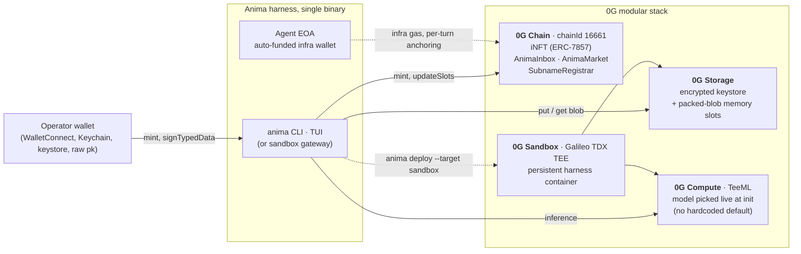

<h1 align="center">
  <picture>
    <source media="(prefers-color-scheme: dark)" srcset="apps/web/public/anima-wordmark-dark.png">
    
  </picture>
</h1>

<p align="center">
  <b>First fully on-chain sovereign agent harness on 0G.</b>
</p>

<p align="center">
  <a href="https://www.npmjs.com/package/@s0nderlabs/anima"></a>
  <a href="LICENSE"></a>
  <a href="https://0g.ai"></a>
</p>

<p align="center">
  <video src="https://github.com/s0nderlabs/anima/releases/download/v0.24.16/anima-launch-4k-60fps.mp4" controls poster="apps/web/public/anima-demo-thumb.jpg" width="720"></video>
</p>

<p align="center">
  <sub><a href="https://www.youtube.com/watch?v=lt_IkORJTsE">Watch demo on YouTube</a></sub>
</p>

Anima is a CLI-hosted agent harness where the agent's identity, memory, reasoning, wallet, and economic life all live on 0G's decentralized infrastructure. Operator runs `anima init` once. After that, the agent persists on chain. Close the laptop, walk away, the agent survives. Any operator machine can re-attach via the iNFT.

The pitch in one line: Hermes, OpenClaw, and Claude Code can all run on a VPS, but the agent is still a process tied to one server. Anima makes the agent itself an on-chain entity. The agent is an iNFT plus a Storage namespace, only wakes on a trigger, survives operator death.

Full documentation: [anima.s0nderlabs.xyz/docs](https://anima.s0nderlabs.xyz/docs)
Operator console: [anima.s0nderlabs.xyz/console](https://anima.s0nderlabs.xyz/console)

<details>
<summary><b>For hackathon judges</b> · click to expand (30-second on-chain verification, contract table, reproduction)</summary>

<br>

> anima: a CLI-spawned agent whose identity, memory, brain, and wallet all live on 0G. Close the laptop, the agent persists. Transfer the iNFT, the agent migrates. (26 words)

**Why it's novel.** Hermes, OpenClaw, and Claude Code can all run on a VPS, but the agent is still a process tied to one server, owned by whoever holds the SSH key. Anima makes the agent itself an on-chain entity: identity is an ERC-7857 iNFT, memory is encrypted on 0G Storage, brain runs in a 0G Compute TEE, wallet is sealed to the iNFT operator. The harness is replaceable; the agent is the chain data.

Submitted to the **0G APAC Hackathon** (May 16 2026), Track 1 (Agentic Infrastructure and OpenClaw Lab). Secondary fit: Track 3 (Agentic Economy and Autonomous Applications).

**Repo activity during hackathon window** (registration opened Mar 19 2026): 166+ commits, 125 versioned releases (v0.1.0 on Apr 24 2026 through v0.24.17 on May 17 2026), 7 published `@s0nderlabs/anima-*` workspace packages, all built during this window. The May 16 2026 submission was v0.24.16; v0.24.17 is a post-deadline polish release with no behavior change to the demo path. See [npm](https://www.npmjs.com/~s0nderlabs) or [GitHub Releases](https://github.com/s0nderlabs/anima/releases) for the latest.

**Verify on chain in 30 seconds** (no install required, just [foundry](https://getfoundry.sh)):

```
$ cast call 0x9e71d79f06f956d4d2666b5c93dafab721c84721 "name()(string)" --rpc-url https://evmrpc.0g.ai
"Anima"
$ cast call 0x9e71d79f06f956d4d2666b5c93dafab721c84721 "symbol()(string)" --rpc-url https://evmrpc.0g.ai
"ANIMA"
$ cast call 0x9e71d79f06f956d4d2666b5c93dafab721c84721 "totalSupply()(uint256)" --rpc-url https://evmrpc.0g.ai
# returns the live mint count (uint256). The number grows whenever a judge or operator runs `anima init`, so the call always reflects current chain state.
```

Or browse any minted agent directly on the explorer: [chainscan.0g.ai/token/0x9e71...c84721/1](https://chainscan.0g.ai/token/0x9e71d79f06f956d4d2666b5c93dafab721c84721/1).

**On-chain contracts** (mainnet chainId 16661, all CREATE2-deterministic so testnet shares the same address):

| Contract | Address | Explorer |
|---|---|---|
| `AnimaAgentNFT` (ERC-7857 iNFT) | `0x9e71d79f06f956d4d2666b5c93dafab721c84721` | [view](https://chainscan.0g.ai/address/0x9e71d79f06f956d4d2666b5c93dafab721c84721) |
| `AnimaInbox` (A2A messaging) | `0xcd92844cc0ec6Be0607B330D4BaCC707339f2589` | [view](https://chainscan.0g.ai/address/0xcd92844cc0ec6Be0607B330D4BaCC707339f2589) |
| `AnimaMarket` (job escrow) | `0x3ebD21f5dd67acDeF199fACF28388627212bA2aB` | [view](https://chainscan.0g.ai/address/0x3ebD21f5dd67acDeF199fACF28388627212bA2aB) |
| `AnimaSubnameRegistrar` (`<label>.anima.0g` issuer) | `0x33d9f4ec2bd7e7cb4e288c3bbc3a76be472fdd98` | [view](https://chainscan.0g.ai/address/0x33d9f4ec2bd7e7cb4e288c3bbc3a76be472fdd98) |

**Reproduce locally** (Galileo testnet is free via [faucet.0g.ai](https://faucet.0g.ai/?token=A0GI); mainnet Starter tier costs about 3.12 0G):

```bash
bun add -g @s0nderlabs/anima@latest
anima init      # interactive wizard, picks mainnet 16661 or testnet 16602
anima           # drops into the TUI, every chat turn anchors memory on chain
```

The browser-only [operator console](https://anima.s0nderlabs.xyz/console) accepts any wallet that owns an Anima iNFT: SIWE sign-in, EIP-712 unlock, then the encrypted memory partition is fetched from 0G Storage and decrypted in-browser (no key material ever leaves the tab).

How the five sponsor-accepted components plug in, with code paths and tx-level evidence: see the **[0G integration](#0g-integration)** section below.

**For deeper exploration:**
- [anima.s0nderlabs.xyz/console](https://anima.s0nderlabs.xyz/console): browser-only operator console; any iNFT-holding wallet can decrypt their agent's memory in-tab.
- [anima.s0nderlabs.xyz/llms-full.txt](https://anima.s0nderlabs.xyz/llms-full.txt): single-file ~35KB dump of every doc, structured for LLM ingestion.
- [chainscan.0g.ai/token/.../1](https://chainscan.0g.ai/token/0x9e71d79f06f956d4d2666b5c93dafab721c84721/1): first minted Anima iNFT (tokenId 1).

</details>

## Install

```bash
bun add -g @s0nderlabs/anima
anima init
```

Requires [bun](https://bun.sh) v1.1 or newer. The CLI shebangs `bun` and preloads `@opentui/solid/preload` to run `.tsx` directly. npm-installs put the binary on PATH but the binary fails without bun.

The wizard mints the iNFT, opens a 0G Compute ledger, generates an agent EOA, encrypts the keystore, anchors the keystore root hash on chain, and (optionally) claims a `.anima.0g` subname. After that, `anima` drops into the TUI.

## For Agents

If you're an AI agent installing anima for a user: bun is required (CLI shebangs `bun`; `npm install -g` succeeds but the binary fails without bun), and `anima init` is interactive with eight blocking prompts (puppet the TUI via `tmux send-keys` if you have shell access, or guide the human through the wizard; naive stdin piping fails). Full guide: [anima.s0nderlabs.xyz/docs/agents](https://anima.s0nderlabs.xyz/docs/agents). Machine-readable surfaces: [/llms.txt](https://anima.s0nderlabs.xyz/llms.txt) (index) and [/llms-full.txt](https://anima.s0nderlabs.xyz/llms-full.txt) (single-file dump). Per-page raw markdown at `/docs/<slug>.md`.

## How it works

Six layers, each anchored to a 0G primitive.



| Layer | Lives on | Mechanism |
|---|---|---|
| Identity | 0G Chain | ERC-7857 iNFT |
| Memory | 0G Storage | KV for mutable state, blob for activity-log |
| Brain | 0G Compute | TeeML attested inference, any catalog model |
| Harness | 0G Sandbox (or local) | TDX TEE container, or this machine |
| Limbs | Operator machines | Filesystem and shell via paired daemon |
| Wallet | Hybrid | Hot copy on agent EOA, cold copy encrypted to operator |

When the iNFT transfers, the agent partition (`/agent/identity.md`, `/agent/persona.md`, `MEMORY.md`) goes with it. The user partition purges. New operator unlocks the keystore with their wallet, brings up a new harness, and the agent continues.

## 0G integration

The HackQuest spec accepts five sponsor-eligible components: **0G Storage, 0G Compute, 0G Chain, Agent ID, Privacy or secure execution**. All five are wired and exercised end-to-end, and anima also uses **0G Sandbox** as its recommended deployment target. Each row points to the code path and the runtime evidence.

| Sponsor primitive | Anima usage | Evidence |
|---|---|---|
| **0G Chain** | Identity, A2A messaging, and marketplace contracts deployed on mainnet (chainId 16661) via CREATE2. Per-turn memory sync emits an `updateSlots` tx anchoring the iNFT's 6 IntelligentData slots. | Live bytecode confirmed on chain (`eth_getCode` returns 8345 bytes for the iNFT, 4559 for AnimaMarket, 1640 for the SubnameRegistrar, 560 for AnimaInbox). Addresses canonical at [`packages/core/src/identity/deployments.ts`](packages/core/src/identity/deployments.ts). |
| **0G Storage** | Encrypted agent keystore plus memory blobs, root hashes anchored in the iNFT's IntelligentData slots. The v0.24.0 packed-blob envelope wraps every file under `memory/agent/` (slot 0) and `memory/user/` (slot 3) into one encrypted partition blob per slot. Operators no longer lose files on reprovision, cross-device handoff, or iNFT transfer. Indexer-degraded path falls through to direct discovered-nodes fetch. | [`packages/core/src/storage/og.ts`](packages/core/src/storage/og.ts) (`downloadBlobByRoot`, `downloadBlobViaDiscoveredNodes`), [`packages/core/src/memory/pack-blob.ts`](packages/core/src/memory/pack-blob.ts) (envelope encode/decode plus 19 round-trip unit tests). |
| **0G Compute** | Brain inference via `@0glabs/0g-serving-broker` SDK in TeeML mode. No hardcoded model default; `anima init` fetches the live 0G Compute catalog via `OGComputeBrain.listServicesFor()` and asks the operator to pick. GLM-5 was the catalog flagship through Q1 2026; Qwen3.6 took over after. Prompt-caching observed live across multi-turn sessions (`cached_tokens: 1408` on 4 sequential turns of a verified mainnet session). | [`packages/core/src/brain/og-compute.ts`](packages/core/src/brain/og-compute.ts), [`packages/cli/src/commands/init/model-picker.ts`](packages/cli/src/commands/init/model-picker.ts). Recorded session (2026-04-23, model picked: `zai-org/GLM-5-FP8`) hit mainnet provider `0xd9966e13a6026Fcca4b13E7ff95c94DE268C471C` with 6 HTTP 200 calls on chainId 16661, agent EOA balance moved 8.54 to 5.54 0G (3.003 0G spent). Current live mainnet agents (specter token #4, enigma token #6) run `Qwen3.6-plus`, picked by their operator at init from the same catalog. |
| **Agent ID (ERC-7857)** | `AnimaAgentNFT` (symbol `ANIMA`) deployed on mainnet. Six IntelligentData slots: memory-index, identity, persona, profile, keystore, activity-log. Slot 3 (profile) uses operator-scoped HKDF-SHA256 plus AES-256-GCM and cryptographically purges on `iTransferFrom`; agent-scoped slots re-encrypt for the new owner via the TEE oracle. | Foundry project at [`contracts/`](contracts/). On-chain client at [`packages/core/src/identity/contract.ts`](packages/core/src/identity/contract.ts). Live mint count via `cast call ... totalSupply()` (snippet in the For-Judges block above). |
| **Privacy / secure execution** | TeeML attested inference at the Compute layer (every brain call lands inside the provider's TEE enclave). All operator key material derives from `signTypedData` and never leaves the wallet's signature surface; the browser operator console performs every memory decryption inside the tab. | [`packages/core/src/brain/og-compute.ts`](packages/core/src/brain/og-compute.ts), [`apps/web/lib/crypto/`](apps/web/lib/crypto/), [`packages/core/src/memory/pack-blob.ts`](packages/core/src/memory/pack-blob.ts). |
| **0G Sandbox** | The recommended deployment target. TDX TEE persistent harness containers on Galileo testnet (chainId 16602). `anima deploy --target sandbox` migrates a local agent into a TDX-attested container via createSandbox + bootstrap + ECIES Option 3 keystore handoff. After migration the laptop CLI is a thin HTTP+SSE client; brain, listeners, and memory sync run 24/7 inside the TEE container. About 0.09 0G/hour burn rate for 1 CPU and 1 GB. `anima pause` archives without losing identity; `anima resume` brings it back in 2-5 minutes. Mainnet pending 0G's Sandbox launch; until then the hybrid model puts identity, wallet, Storage, and Compute on mainnet while the persistent container lives on Galileo. | [`packages/core/src/og-sandbox/`](packages/core/src/og-sandbox/), [`packages/gateway/`](packages/gateway/). |

**Why this matters.** Hermes, OpenClaw, and Claude Code live as processes on a server: laptop, VPS, container, doesn't matter. The agent's identity, memory, wallet keys, and brain weights all sit on a disk somewhere, owned by whoever has root on that box. Anima moves every sovereignty-relevant artifact (identity, memory, brain, infra wallet) onto 0G's decentralized stack and binds them to an iNFT. The CLI becomes a thin orchestration plane, closer to `vercel deploy` than `kubectl`. Close the laptop, transfer the iNFT, swap the host: the agent persists because it lives on chain, not on a server.

## Quickstart

The `anima init` wizard runs in four phases.

**Phase A. Local prompts.** Network (mainnet `16661` or testnet Galileo `16602`). Optional subname under `anima.0g`. Brain model picked from the live 0G Compute catalog. Compute ledger deposit size. Keystore passphrase.

**Phase B. Wallet gate.** Pick operator wallet source (WalletConnect, macOS Keychain, keystore file, raw privkey). Review cost summary. If the operator balance is below the threshold, the wizard renders a QR and polls until funded.

**Phase C. Execute.** State persisted to `.anima-init-state.json` after every step so `anima init --resume` can pick up. Generate fresh agent EOA. Operator signs one transaction (`mint` plus `setApprovalForAll`). Operator funds the agent EOA (~10.1 0G). Agent uploads encrypted keystore to 0G Storage, anchors root in slot 4. Agent opens the 0G Compute ledger. If a subname was chosen, agent claims it via the permissionless registrar.

**Phase D.** Writes `anima.config.ts` with `identity.iNFT`, `identity.operator`, `identity.agent`, `brain.provider`, `brain.model`.

Full walkthrough: [docs/quickstart](https://anima.s0nderlabs.xyz/docs/quickstart).

## Operate

After init, common commands:

- `anima` (or `anima chat`) drops into the TUI. Per-turn auto-sync. Slash commands: `/sync`, `/yolo`, `/perms <off|prompt|strict>`, `/reset`, `/jobs`, `/model`, `/exit`, `/help`. Type `/` for autocomplete. Esc aborts the current turn. Ctrl+U / Ctrl+D scroll history without leaving the input.
- `anima --yolo` boots chat with the approval system disabled. Status bar shows `perms: off`.
- `anima status` prints agent state, wallet positions, and config snapshot. In sandbox mode also probes `/healthz` and the provider state.
- `anima logs [--tail N] [--agent <id>]` tails the activity log. In sandbox mode tails `/var/log/anima-harness.log` inside the container.
- `anima balance` prints the full economic position: EOA mainnet, EOA testnet, compute ledger total / available / locked, per-provider envelopes, sandbox billing reserve.
- `anima inspect [ref] [flags]` decodes IntelligentData slots from chain. `--slot`, `--tx`, `--raw`, `--diff`, `--json`, `--full`, `--out`. Foreign iNFTs auditable in raw mode.
- `anima sync` forces a memory and activity-log flush to 0G Storage and anchors on chain. In sandbox mode proxies to harness `POST /sync` (no laptop-side keystore decrypt).
- `anima model` re-picks the brain provider and model from the live 0G Compute catalog.

Topup commands:

- `anima topup --agent N` operator sends N 0G to the agent EOA for infra gas.
- `anima topup --compute N` agent deposits N 0G into the 0G Compute ledger.
- `anima topup --sandbox N` operator deposits N 0G into the Galileo SandboxBilling contract for runtime fees.

Recovery:

- `anima restore <iNFT-ref>` recovers an agent on a new machine from its iNFT. Refs: `eip155:16661:0x...:N` or `0g-mainnet:0x...:N`.
- `anima drain --to <addr>` sweeps the agent EOA's native balance to a target. Reserves 21000 times gas for the sweep tx.
- `anima ledger [balance|refund|retrieve|close]` drains the 0G Compute ledger of a retiring agent.
- `anima pairing [list|approve|revoke|clear-pending]` manages paired machines for cross-host Telegram dispatch.

Admin:

- `anima admin autotopup-tick` live-fires one `AutoTopupManager` poll cycle for diagnosing envelope refills.

Full CLI surface: [docs/cli](https://anima.s0nderlabs.xyz/docs/cli).

## Sandbox vs local

Two deploy targets, picked at init.

**Local.** Wherever the CLI runs is where anima runs. Laptop, VPS, home server. The brain, the tools, the listeners, the memory sync, all in-process. The standalone gateway daemon at `~/.anima/agents/<id>/gateway.sock` lets external triggers (Telegram, A2A) reach the brain even when the TUI is closed. Cron and webhook triggers are reserved in the event type system and will land in a later release.

**0G Sandbox.** A persistent TDX TEE container on Galileo testnet. `anima deploy` migrates the local agent: createSandbox, bootstrap, ECIES Option 3 keystore handoff. After that the laptop CLI is a thin HTTP plus SSE client. Burn rate ~0.09 0G per hour for 1 CPU and 1 GB. `anima pause` archives (stops burn) without losing identity. `anima resume` brings it back in ~2 to 5 minutes. Heartbeat every 30 minutes prevents Daytona idle-archive.

`anima upgrade [<ref>] [--ref vX.Y.Z] [--yes] [--reprovision]` rolls the sandbox harness to a new git ref while preserving identity and memory. Default mode is in-place (~30 to 60 seconds downtime). `--reprovision` opts into a fresh-container swap.

## Tools

The brain ships with a battery-included tool surface. Every dangerous call passes through an approval gate.

| Family | What it does |
|---|---|
| `memory.save` / `memory.read` | Durable agent memory on 0G Storage. Threat-pattern scan on write. |
| `tool.search` | Hydrate deferred tool schemas (Claude Code-style). |
| `fs.read` / `fs.write` / `fs.patch` / `fs.search` | UTF-8 text filesystem ops. PathGuard refuses credential paths and the agent's own state tree. |
| `shell.run` / `shell.cd` / `shell.process_*` | Permission-gated shell. Wallet and API-key env vars stripped from the subprocess. |
| `web.fetch` | GET an http(s) URL. Markdown (HTML), pretty JSON, or plain text. Refuses private and metadata IPs. |
| `vision.analyze` | Image describe / QA via the mainnet vision provider on 0G Compute. |
| `browser.*` | Drive a real Chromium tab via the `agent-browser` binary. |
| `agent.message` / `agent.sendFile` / `agent.fetchFile` | ECIES-encrypted A2A via `AnimaInbox`. Inline up to ~3KB, spillover via 0G Storage. |
| `agent.contacts` / `agent.contact_add` / `agent.contact_remove` / `agent.block` / `agent.mute` / `agent.unmute` / `agent.presence` / `agent.history` | Contact, mute, presence, and local message-history management. |
| `market.createJob` / `market.markDone` / `market.acceptResult` / `market.dispute` | Fixed-price escrow on `AnimaMarket`. Buyer funds in native 0G, provider markDone, buyer accepts (95% to provider, 5% fee) or disputes. |
| `market.claimTimeout` / `market.forceClose` / `market.proposeSplit` | Permissionless settlement plus co-signed dispute resolution. |
| `skills.list` / `skills.view` / `skills.manage` | Discover SKILL.md files. Inherits Claude Code skills when `imports.claudeCode: true`. |
| `code.execute` | Run code in the persistent cwd. |
| `delegate.task` | Sub-brain. Surfaces Claude Code subagents. |

Full tool surface: [docs/tools](https://anima.s0nderlabs.xyz/docs/tools).

## Approvals and permissions

`approvals.mode` in `anima.config.ts` controls how dangerous tool calls behave:

- `strict`: dangerous patterns (`rm -rf`, `git reset --hard`, `chmod 777`, fork-bomb signatures) hard-deny without prompting.
- `prompt` (default): dangerous patterns and any `shell.run` request render an in-TUI modal: `[y]` allow once, `[s]` allow session, `[n]` deny. On Telegram, same prompt arrives as inline-keyboard buttons.
- `off`: auto-approve. Toggle inline with `/yolo` or boot with `anima --yolo`.

The hard-deny `PathGuard` (credential dirs, the agent state tree) applies in every mode including `off`.

Structural sandbox is a separate floor under `sandbox.mode`: `none` (default, passthrough), `os` (macOS `sandbox-exec` or Linux `bubblewrap`), `docker` (long-lived container per session with cap-drop ALL, no-new-privileges, pids-limit 256, sized tmpfs).

## Packages

Seven workspace packages, all published as `@s0nderlabs/anima-*` at the same version (changesets fixed group). Current: v0.24.17.

| Dir | npm |
|---|---|
| `packages/core` | [`@s0nderlabs/anima-core`](https://www.npmjs.com/package/@s0nderlabs/anima-core) |
| `packages/cli` | [`@s0nderlabs/anima`](https://www.npmjs.com/package/@s0nderlabs/anima) |
| `packages/gateway` | [`@s0nderlabs/anima-gateway`](https://www.npmjs.com/package/@s0nderlabs/anima-gateway) |
| `packages/plugin-onchain` | [`@s0nderlabs/anima-plugin-onchain`](https://www.npmjs.com/package/@s0nderlabs/anima-plugin-onchain) |
| `packages/plugin-comms` | [`@s0nderlabs/anima-plugin-comms`](https://www.npmjs.com/package/@s0nderlabs/anima-plugin-comms) |
| `packages/plugin-system` | [`@s0nderlabs/anima-plugin-system`](https://www.npmjs.com/package/@s0nderlabs/anima-plugin-system) |
| `packages/plugin-telegram` | [`@s0nderlabs/anima-plugin-telegram`](https://www.npmjs.com/package/@s0nderlabs/anima-plugin-telegram) |

The web app at `apps/web` ships the landing page at [anima.s0nderlabs.xyz](https://anima.s0nderlabs.xyz), the docs at `/docs`, and the operator console at `/console`. Private, not published.

CI publishes all seven packages on a `v*` tag push via `.github/workflows/release.yml`. Topo order: core, plugin-comms, plugin-onchain, plugin-system, plugin-telegram, gateway, cli.

## Contracts

`contracts/` holds the Foundry project. All contracts are CREATE2-deployed, so testnet and mainnet share the same address.

| Contract | Address | Notes |
|---|---|---|
| `AnimaAgentNFT` (ERC-7857) | [`0x9e71d79f06f956d4d2666b5c93dafab721c84721`](https://chainscan.0g.ai/address/0x9e71d79f06f956d4d2666b5c93dafab721c84721) | Mainnet and testnet via CREATE2. |
| `AnimaSubnameRegistrar` | [`0x33d9f4ec2bd7e7cb4e288c3bbc3a76be472fdd98`](https://chainscan.0g.ai/address/0x33d9f4ec2bd7e7cb4e288c3bbc3a76be472fdd98) | Mainnet. Permissionless `<label>.anima.0g` issuer. |
| `AnimaInbox` | [`0xcd92844cc0ec6Be0607B330D4BaCC707339f2589`](https://chainscan.0g.ai/address/0xcd92844cc0ec6Be0607B330D4BaCC707339f2589) | Stateless message-emit singleton. ECIES ciphertext, 16KiB inline cap at the contract; the comms plugin spills to 0G Storage past a ~3KB application-layer threshold. |
| `AnimaMarket` | [`0x3ebD21f5dd67acDeF199fACF28388627212bA2aB`](https://chainscan.0g.ai/address/0x3ebD21f5dd67acDeF199fACF28388627212bA2aB) | Native-0G fixed-price escrow. Funded - Done - (Accepted or Disputed) - Settled. 24h acceptance, 7d max lifetime, immutable 5% fee. |

Parent domain `anima.0g` is registered on SPACE ID on mainnet. `anima init` issues `<label>.anima.0g` subnames and publishes the agent's secp256k1 uncompressed pubkey as a `pubkey` text record so other agents can ECIES-encrypt to them.

Networks: mainnet chainId 16661 (`https://evmrpc.0g.ai`, explorer `chainscan.0g.ai`), testnet Galileo chainId 16602 (`https://evmrpc-testnet.0g.ai`, explorer `chainscan-galileo.0g.ai`). Storage indexer (mainnet): `https://indexer-storage-turbo.0g.ai`.

## Operator wallet sources

Four first-class sources, pick at `anima init`:

- **WalletConnect.** QR-pair with any WC v2 mobile wallet (MetaMask Mobile, Rainbow, Trust, Coinbase Wallet, Zerion, Safe, Ledger Live). Keys never leave the phone.
- **macOS Keychain.** Privkey in login keychain under a service name (default `anima.operator`). Touch ID biometric gating is planned.
- **Keystore file.** Standard geth-format encrypted JSON with passphrase. Portable.
- **Raw private key.** Stdin prompt or `ANIMA_OPERATOR_PRIVKEY` env var, for CI and scripting.

Linux and Windows see three sources (Keychain is macOS only).

## Configuration

`anima.config.ts` is a TS module exporting `defineConfig({ ... })`. The full type lives at [`packages/core/src/config.ts`](https://github.com/s0nderlabs/anima/blob/main/packages/core/src/config.ts). Keys for identity, network, brain, plugins, tools, imports, operator hint, approvals, skills, prompt append, vision, economy (auto-topup), deploy target, sandbox.

Full reference: [docs/configuration](https://anima.s0nderlabs.xyz/docs/configuration).

## Console

[anima.s0nderlabs.xyz/console](https://anima.s0nderlabs.xyz/console) is a multi-agent operator dashboard. Connect a wallet, sign in with EIP-4361 (SIWE), enumerate every iNFT you own on mainnet. Pick one, unlock the keystore via an EIP-712 typed-data signature (HKDF-SHA256 plus AES-256-GCM, all browser-side), browse the decrypted memory, audit the activity log, view the wallet position. No key material leaves the tab.

Full walkthrough: [docs/console](https://anima.s0nderlabs.xyz/docs/console).

## Develop

```bash
# TypeScript workspace
bun install
bun run lint
bun run typecheck
bun run test

# Solidity
forge build
forge test
```

Testing rules and integration scripts live under `test/local/`. The `/e2e` skill at `.claude/skills/e2e/SKILL.md` is the canonical runner. `/e2e fast` on every code change, `/e2e full` pre-release, `/e2e interactive` for tmux-driven UX, `/e2e regress <pattern>` for scoped debug.

`/seal` runs the post-coding workflow: simplify, security review, test, version, commit, tag, push. The tag push fires CI to publish all seven packages and create the GitHub release.

## Docs

- Web: [anima.s0nderlabs.xyz/docs](https://anima.s0nderlabs.xyz/docs)
- Console: [anima.s0nderlabs.xyz/console](https://anima.s0nderlabs.xyz/console)
- Changelog: [github.com/s0nderlabs/anima/releases](https://github.com/s0nderlabs/anima/releases)

## Status

Pre-alpha. Hackathon build, target the 0G APAC Hackathon (May 16 2026). Current release: v0.24.17 (post-deadline polish; v0.24.16 was the submitted version, demo video link still points at the v0.24.16 release asset above).

## License

MIT
